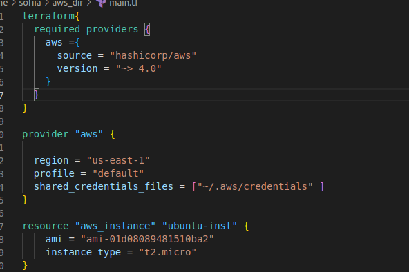
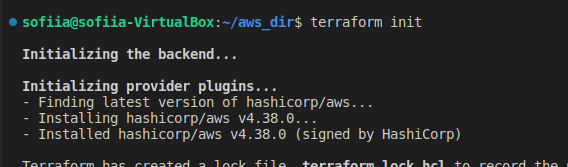
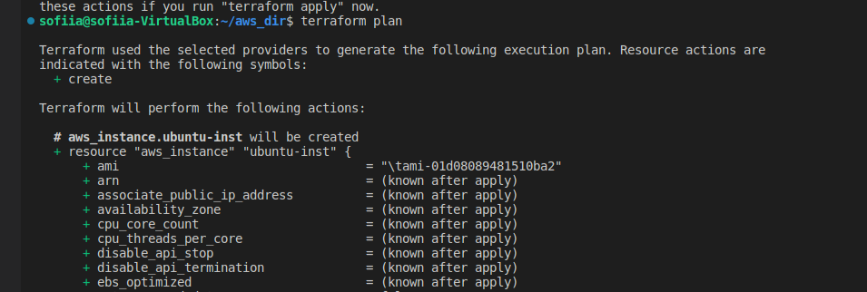
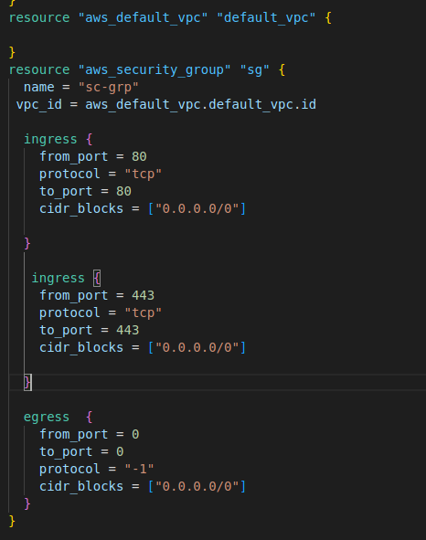
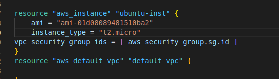
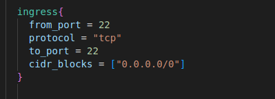
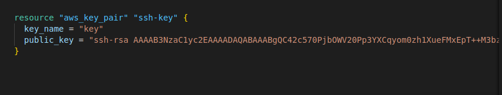
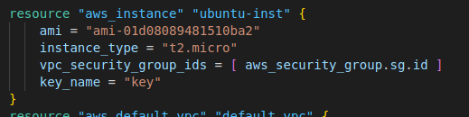
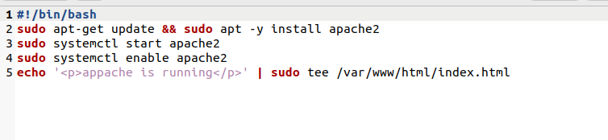
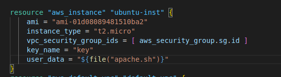

# Лабораторна робота №4

1. Створення ubuntu 20.04 instance
   
   Блок terraform {} містить налаштування Terraform, у тому числі необхідні провайдери, які Terraform використовуватиме для забезпеченняінфраструктури.

Блоки ресурсів мають два рядки перед блоком: тип ресурсу та ім’я ресурсу. У цьому прикладі тип ресурсу – aws_instance, а ім’я –ubuntu-inst.

2. Дозвіл HTTP/HTTPS трафіку
   

ingress: блок, що містить конфігурацію для правил вхідного трафіку.
egress: Блок, що містить конфігурацію для правил вихідного трафіку.
from_port: Позначає номер початкового порту.
to_port: Позначає кінцевий порт.

3. SSH public key
   
   ingress блок, що дозволяє вхідному трафіку SSH отримати доступ до VPS через протокол SSH з віддаленої машини
   
   Створення key_pair
   
   Додання назви ключа до aws_instance
4. Apache web server використовуючи bash scenario
   

Bash скрипт установки та запуску apache2

Додання скрипту до instance за допомогою user_data
