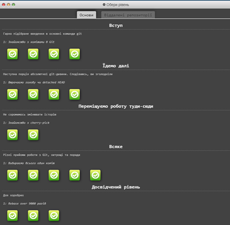
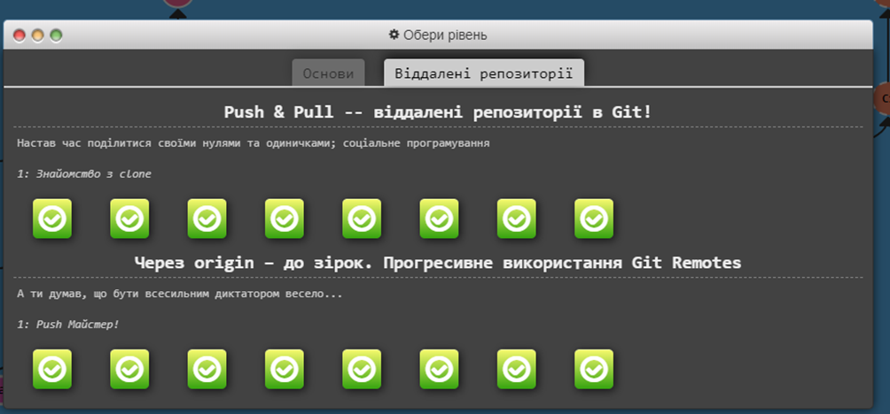
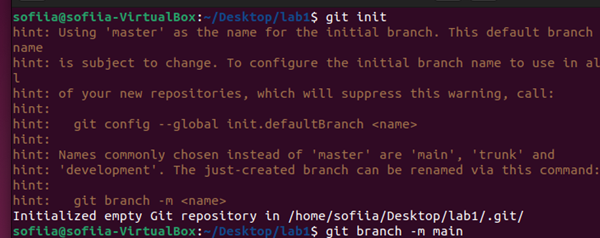
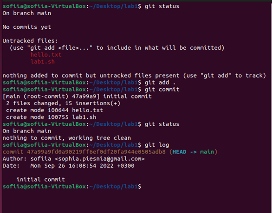
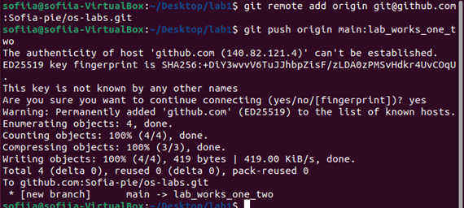

# Лабораторна робота №2. Основні команди системи контролю версій Git.

1. Пройти гру Git Learn та зробити скріншоти пройдених рівнів.

2. Зробити `git init` папки із файлом  hello.txt та bash скриптом.

3. Зробити `git commit`.

4. Зробити `git push` у віддалений репозиторій у вітку lab_works_one_two.

5. Додати в папку Readme файл із звітом до лабораторної, щоб його можна було передивлятись на репозиторію коли переходиш у вітку.
