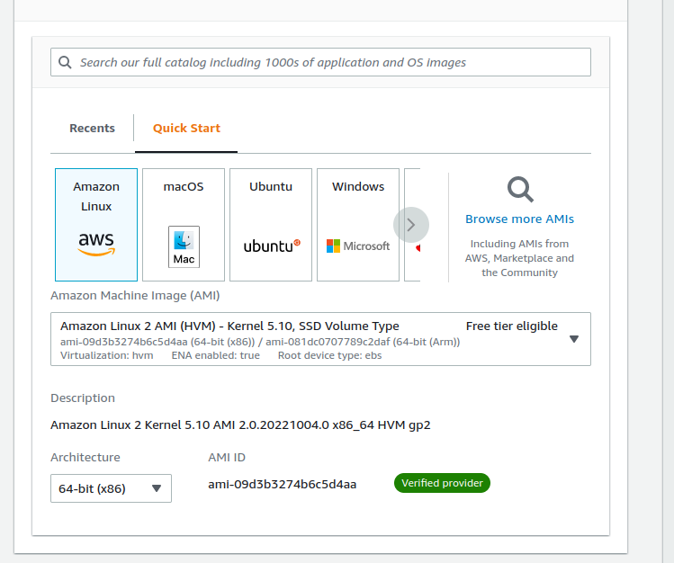
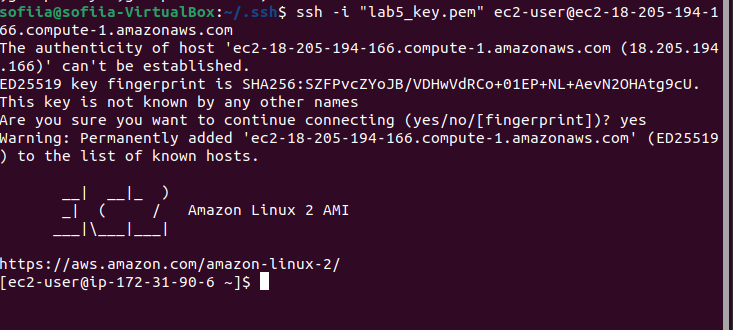
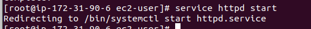
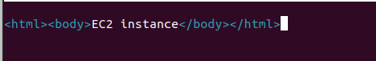

# Лабораторна робота №3. Docker.

1. Використання готових Docker Images.

Docker image wordpress

Запуск wordpress контейнера на localhost:8080

Докер контейнер для датабази mysql

Образи wordpress та mysql та запущені контейнери

Налаштування wordpress

Wordpress сайт

2. Використання Docker Compose.

Compose — це інструмент для визначення та запуску багатоконтейнерних програм Docker. Файл YAML використовується для налаштування сервісів програми. Потім за допомогою однієї команди(docker-compose up) створюються та запускаються всі сервіси з конфігурації.

У YAML файлі потрібно вказати версію формату файлу Compose, принаймні один сервіс та, за бажанням, томи та мережі:

version: "3.7"

services:

` `...

volumes:

` `...

networks:

` `...

Переваги використання Docker Compose :

- Швидке та просте налаштування: завдяки файлу YAML і змінним середовища можна легко налаштувати або змінити сервіси додатків.
- Безпечний внутрішній зв'язок. Compose створює спільний network для всіх сервісів. Це додає додатковий рівень безпеки для програми, оскільки до сервісів неможливо отримати зовнішній доступ.
- Ефективне використання ресурсів. Docker Compose дозволяє розміщувати кілька ізольованих середовищ на одному хості.

3. Створення HTML сторінки та занесення її в Docker Image. Залити даний Docker Image на Docker Hub.

Dockerfile для створення образу

HTML сторінка

Створення image

Запуск контейнеру на localhost:8050

Перевірка працездатності контейнера

Push образу на Docker Hub

4. Скачати Docker Image когось із групи і розвернути в себе контейнер з HTML сторінкою на порті 8086 ззовні.

Pull образу з Docker Hub

Запуск контейнера на порті 8086
